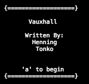
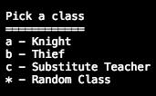
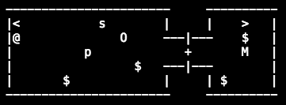
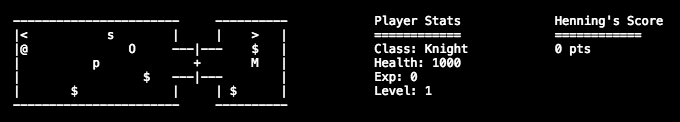
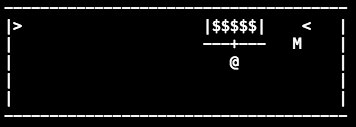
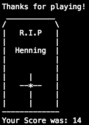

# Vauxhall

## How To Play
1) Enter the directory containing the Vauxhall binary file
2) Run it using "./Vauxhall Name" (Substituting "Name" for your players name)

Ex: ```./Vauxhall Henning```

Play with your Terminal window in fullscreen to avoid rendering issues

## Keys
* wasd or hjkl - movement
* , - picks up item currently standing on
* o + a direction key - opens door in specified direction
* c + a direction key - closes door in specified direction
* i - Displays your current inventory (press another key to close)
* < or > - Goes up or down a floor (respectively) if you are standing on that character
* f - Displays your characters stats
* r - Rests and heals your character
* z - Drinks a potion (healing you) if you have any potions

# Screenshots

Beginning of the game:



Picking a class:



Enter the first level:



Checking our stats:



Down to the second level:



When you die or quit:



## Dependancies
* [ANSI Terminal](https://hackage.haskell.org/package/ansi-terminal) - Used for rendering game.